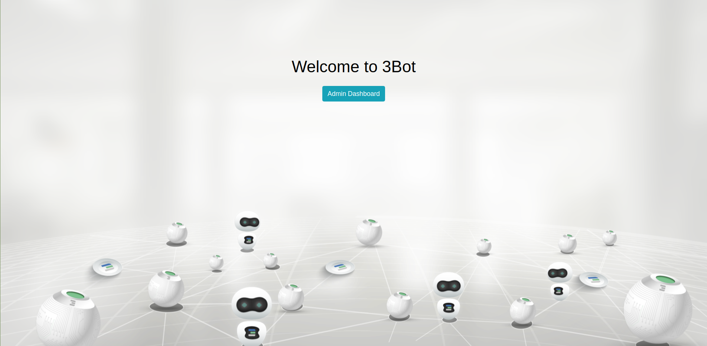
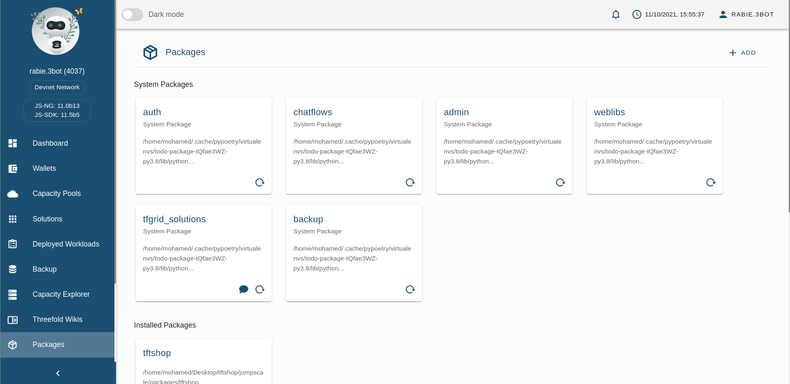
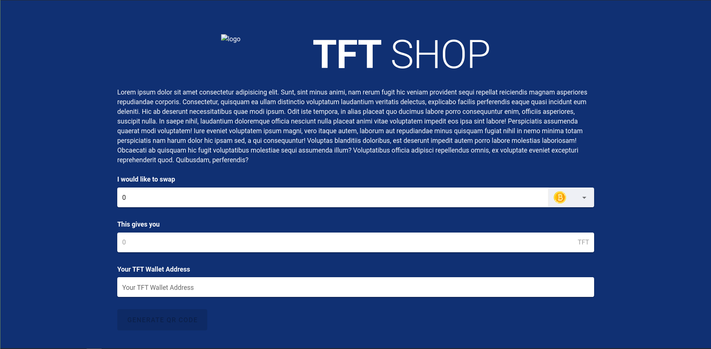

# IT As Energy Shop

  
IT As Energy Shop is a jumpscale package allows to exchange bitcoins and (later) more coins like eth to TFT.

## Content

- [Prerequisite](#prerequisite)
- [Download](#download)
- [Install](#install)
- [Configure Wallets](#config-wallets)
- [Configure backup](#config-backup)
- [Serve](#serve)
- [Install Package](#install-package)

---

### Prerequisite

- [Python 3.x](https://www.python.org/)
- [Poetry](https://python-poetry.org/docs/#installation)
- [ThreeFold Connector](https://play.google.com/store/apps/details?id=org.jimber.threebotlogin&hl=en&gl=US)
- [Electrum Wallet](https://electrum.org/#home)

```sh
rm -r ~/.electrum/ # Avoid using this if u already using any stored wallet
electrum daemon -d --testnet # Start daemon on testnet server
```

### Download

Clone Project

```sh
git clone git@github.com:threefoldfoundation/tftshop.git
cd tftshop
```

### Install

```sh
poetry shell
poetry install
```

### Configure Wallets

1. Create new wallet

   ```sh
   # Make sure to store output
   electrum create -w ~/.electrum/testnet/WALLET_NAME --testnet
   ```

2. Load Wallet

   ```sh
   electrum load_wallet -w ~/.electrum/testnet/WALLET_NAME --testnet
   ```

3. Generate [Master Public Key] `mpk` for wallet

   ```sh
   # output is the master public key that we are looking for.
   electrum getmpk -w ~/.electrum/testnet/WALLET_NAME --testnet
   ```

4. Using `jsng shell` and add your

   ```py
   # Run jsng on terminal inside `poetry shell`
   j.core.config.set("tftshop_mpk", "YOUR MASTER PUBLIC KEY")

   # Register your stellar *tft wallet* IMPORTANT!!
   j.clients.stellar.new("tftshop_wallet", "your secret")
   ```

### Configure backup

We are using the same mechanism from threebot backup service, so to have a threebot system backup, you need to configure a `restic client` with the name `systembackupclient`

```python
systembackupclient = j.tools.restic.get("systembackupclient", repo="$repo_url", password="$backup_password", extra_env={"AWS_ACCESS_KEY_ID": "$AWS_ACCESS_KEY_ID", "AWS_SECRET_ACCESS_KEY": "$AWS_ACCESS_KEY_ID"})"
```

 and it will make sure to backup
`~/.config/jumpscale/`, `"~/sandbox/cfg/` and `~/.ssh/` exclulding the `~/.config/jumpscale/logs` directory

#### Tips

On OSX, after installing the Electrum app, the `run_electrum` command is avalable in the `/Applications/Electrum.app/Contents/MacOS` folder.

### Serve

```sh
threebot start --local
```

> Check UI: [https://localhost:8443/](https://localhost:8443/)

### Install Package

1. Login using ThreeFold Connector

   
2. Go to [Packages Page](https://localhost:8443/admin/#/packages)

   
3. Click on `+ ADD` button on top right corner.
4. Add package path for e.g `/home/mohamed/Desktop/tftshop/jumpscale/packages/gettft`

   
5. Click `submit` button
6. Visit Ui on [https://localhost:8443/gettft/](https://localhost:8443/gettft/)

   

### Install using helm

build the docker image

```sh
docker build -t tftshop:$(git describe --abbrev=0 --tags | sed 's/^v//') .
```

Upload the image to the kubernetes machine or to a repository and override the image in your values.yaml then.

```sh
helm install tftshop -f <yourvaluesfile.yaml> helmcharts/tftshop
```

### Installation remarks

It is important that the jsngmodel and the electrum wallet data are not lost. If so, we do not know who sent the other crypto or deposit addresses can be distributed multiple times.  

### Set email configurations

To send emails after each successful operation, this uses notifier service in admin panel

- ENV:
  - email_host: example: "smtp.gmail.com"
  - email_port: example: "587"
  - email_username
  - email_password

### Set prices limit

- Edit in `limits.json`
